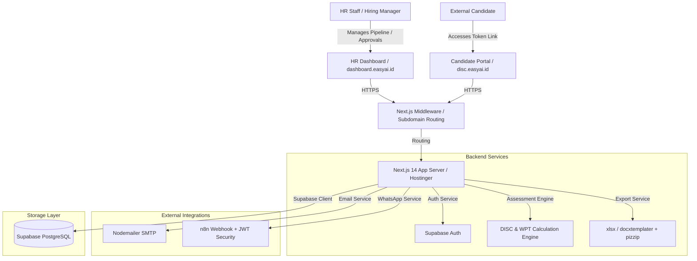
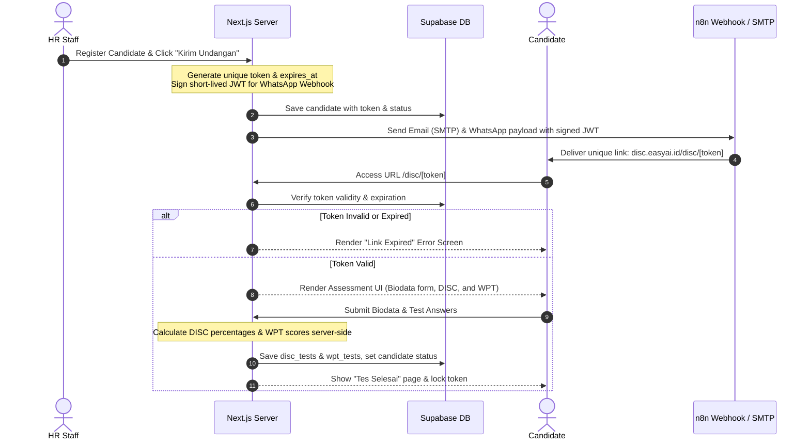
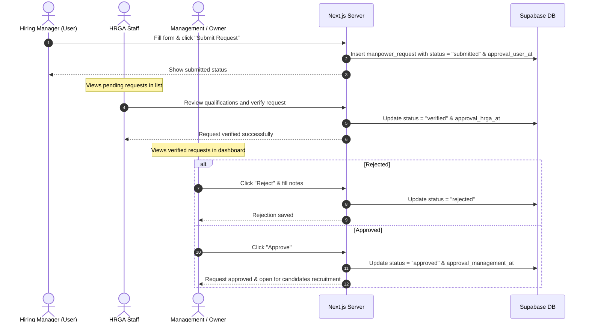

# EasyLegal HR Recruitment System Preparation Analysis Report

Analysis of the **EasyLegal HR Recruitment System PRD v1.0.0** (Juni 2026). This report is prepared to establish the architectural baseline, identify gaps/risks, design the data models, and outline the implementation phases.

---

## 1. Executive Summary

PT EasyLegal is implementing a digital transformation for its internal recruitment operations to replace manual and paper-based processes. The system centers around two primary operations:
1. **Internal HR & Hiring Manager Portal (`dashboard.easyai.id`):** A centralized dashboard managing manpower requests with a 3-level approval workflow, candidate pipelines, interview evaluations, selection test results, and export capabilities.
2. **External Candidate Portal (`disc.easyai.id`):** A lightweight, responsive, and mobile-friendly assessment portal where candidates complete their biodata and undergo online DISC (Personality) and WPT (Cognitive) tests using secure, single-use tokens.

---

## 2. Recommended System Architecture

Based on the requirements (responsiveness, subdomain separation, real-time activity logging, and Hostinger deployment), here is the proposed technical stack:



### Stack Selection & Trade-Offs

| Layer | Recommended | PRD Alternative | Rationale |
| :--- | :--- | :--- | :--- |
| **Framework** | **Next.js 14 (App Router)** | Single Page App (SPA) + Express | Next.js handles subdomain routing (`dashboard.` and `disc.`) natively in [middleware.ts](file:///d:/Folder%20Kerjaan/websiteHR/recruit-EL/src/middleware.ts), and provides Server Actions for secure database operations. |
| **Database** | **Supabase (PostgreSQL)** | Local SQL Server / MySQL | Supabase provides built-in authentication, an instant REST API, and PostgreSQL's robust JSONB capabilities to store dynamic test responses and logs efficiently. |
| **Styling** | **Tailwind CSS + shadcn/ui** | Vanilla CSS | Combining Tailwind with shadcn/ui ensures a responsive, premium "Corporate Clean" interface, speeding up component building while maintaining strict design system tokens. |
| **Document Export** | **docxtemplater + pizzip** | HTML-to-PDF Renderer | Rather than dealing with slow, pixel-imperfect PDF renderers, `docxtemplater` allows HR to upload pre-formatted Word templates (.docx) that are populated dynamically, preserving formatting. |
| **Notifications** | **n8n WA Webhook + Nodemailer** | Direct Twilio / SMS APIs | n8n allows HR to modify the WhatsApp notification template and flow without changing the core codebase. Security is maintained using JWT signatures. |

---

## 3. Database Schema Design (ERD)

Here is the relational database schema model configured for Supabase PostgreSQL. All table interactions are declared in [db.ts](file:///d:/Folder%20Kerjaan/websiteHR/recruit-EL/src/lib/db.ts) and types in [types.ts](file:///d:/Folder%20Kerjaan/websiteHR/recruit-EL/src/lib/types.ts).

```mermaid
erDiagram
    logs {
        string id PK
        string action "CREATE / UPDATE / DELETE"
        string table_name
        string record_id
        string description
        jsonb details
        string user_email
        timestamp created_at
    }

    manpower_requests {
        string id PK "mr-timestamp"
        string no_request UK "MR/MM/YYYY/SEQ"
        date tanggal
        string divisi
        string pemohon
        string jabatan_pemohon
        string atasan_pemohon
        string posisi
        integer jumlah
        string lokasi
        date tanggal_dibutuhkan
        string jenis_kebutuhan "Posisi Baru / Replacement / Tambahan Tim"
        string replacement_name
        string status_karyawan "PKWT / PKWTT / Magang / Outsource"
        string urgensi "Tinggi / Sedang / Rendah"
        text alasan
        text jobdesk
        jsonb kualifikasi "pendidikan, pengalaman, keahlian, softskill, catatan"
        jsonb range_gaji "min, max"
        text benefit
        string status "draft / submitted / verified / approved / rejected"
        timestamp approval_user_at
        timestamp approval_hrga_at
        timestamp approval_management_at
    }

    candidates {
        string id PK "cnd-timestamp"
        string nama
        string email
        string telepon
        string posisi_dilamar
        string manpower_request_id FK
        string token UK
        date token_expires_at
        string status "interview_user / offering / reject"
        timestamp created_at
        text pendidikan
        text pengalaman
        text keahlian
    }

    disc_tests {
        string id PK "dt-timestamp"
        string candidate_id FK UK
        jsonb answers "questionId, most, least"
        integer skor_d
        integer skor_i
        integer skor_s
        integer skor_c
        numeric persen_d
        numeric persen_i
        numeric persen_s
        numeric persen_c
        string tipe_primer
        string tipe_sekunder
        timestamp completed_at
    }

    wpt_tests {
        string id PK "wpt-timestamp"
        string candidate_id FK UK
        jsonb answers "questionId, answer"
        integer skor
        integer total_soal
        numeric persen_benar
        string kategori "Superior / Sangat Baik / Baik / Cukup / Perlu Perhatian / ..."
        jsonb profil_kemampuan "category, total, benar, persen, keterangan"
        jsonb rekomendasi_posisi "posisi, skorMin, skorIdeal, status, rekomendasi"
        timestamp completed_at
    }

    interview_evaluations {
        string id PK "ie-timestamp"
        string candidate_id FK
        date tanggal
        string tahap "HRGA / User / Final"
        string interviewer
        string metode "Online / Offline"
        numeric ekspektasi_gaji
        string ketersediaan_bergabung
        jsonb penilaian "aspek, skor, catatan"
        integer total_skor
        text kelebihan
        text area_digali
        text catatan
        string rekomendasi "Lanjut Tahap Berikutnya / Talent Pool / Tidak Lanjut"
    }

    selection_test_results {
        string id PK "st-timestamp"
        string candidate_id FK
        date tanggal_tes
        string penyelenggara
        jsonb komponen "nama, nilai, batas_lulus, catatan"
        string kesimpulan "Lulus / Lulus Bersyarat / Tidak Lulus"
        text catatan_akhir
    }

    manpower_requests ||--o{ candidates : "fulfills"
    candidates ||--|| disc_tests : "takes"
    candidates ||--|| wpt_tests : "takes"
    candidates ||--o{ interview_evaluations : "evaluated_by"
    candidates ||--o{ selection_test_results : "assessed_by"
```

---

## 4. Key Functional Flows

### A. Candidate Assessment Invitation & Token Validation Flow

This sequence diagram illustrates how external candidates securely access and submit their assessments without authenticating via username/password:



### B. Manpower Request Approval Sequence Flow (FR-HRGA-001.01)

The recruitment workflow begins with a three-level approval flow to ensure manpower requisitions match budget and staffing requirements:



---

## 5. Identified Gaps & Open Questions

> [!WARNING]
> The following technical requirements in the PRD are currently open or require verification before final code modifications:

1. **WPT Test Time Limit Enforcement:**
   - The Wonderlic Personnel Test (WPT) mandates a strict 12-minute time limit for 50 questions. 
   - *Recommendation:* To prevent candidates from bypassing the timer (e.g., closing the tab or freezing JavaScript), the server should save `started_at` in the database when the candidate clicks "Mulai Tes". Upon submission, the server verifies `completed_at - started_at <= 12 minutes 30 seconds` (allowing a 30s buffer for network latency) before recording the score.
2. **Subdomain Routing on Hostinger:**
   - Hostinger Node.js application configurations can occasionally conflict with Next.js middleware subdomain extraction.
   - *Action Item:* HR needs to ensure wildcard subdomain mappings (`*.easyai.id`) are pointed to the Next.js application port, or configure explicit subdomain redirects mapping `dashboard.easyai.id` and `disc.easyai.id` to the respective Node server instances.
3. **Candidate CV Document Storage:**
   - The PRD lists inputs for candidate education, experience, and skills, but doesn't specify if candidates must upload their physical CV (PDF/DOCX).
   - *Question:* Should we provision a Supabase Storage bucket for storing candidate resume uploads? If yes, what is the file size limit (e.g., maximum 5MB)?
4. **Export Word/PDF Format Alignment:**
   - The system utilizes `docxtemplater` + `pizzip` to create report files.
   - *Action Item:* HR must upload the blank master templates of `FR-HRGA-001.02` (Hasil Seleksi) and `FR-HRGA-001.03` (Evaluasi Wawancara) containing appropriate template variables (e.g. `{nama_kandidat}`, `{total_skor}`) to the `/public/templates/` folder.

---

## 6. Security & Mitigation Strategy

* **Calculation Integrity:** Calculations for DISC graphs (Most/Least counts) and WPT categories (Verbal, Numeric, Logic) are processed strictly in server actions ([discParser.ts](file:///d:/Folder%20Kerjaan/websiteHR/recruit-EL/src/lib/discParser.ts) and [wptParser.ts](file:///d:/Folder%20Kerjaan/websiteHR/recruit-EL/src/lib/wptParser.ts)). No scoring keys are compiled in the candidate's client bundle.
* **Token Invalidation:** Candidate assessment tokens are strictly single-use. Once the candidate submits their test, the system locks the token, blocking subsequent page loads.
* **WhatsApp JWT Security:** In n8n integrations, a JWT signed using a shared HS256 secret (`N8N_JWT_SECRET`) is passed in the header. The webhook verifies the payload authenticity to prevent unverified WhatsApp message triggers.
* **Supabase Row Level Security (RLS):** All queries in [db.ts](file:///d:/Folder%20Kerjaan/websiteHR/recruit-EL/src/lib/db.ts) enforce RLS using Supabase auth tokens. Users can read candidate profiles and test results only if they are logged in with role `hr_staff` or `admin`.

---

## 7. Preliminary Project Timeline (Phased Roadmap)

The project scope can be delivered across a compressed 6-week timeline using the unified Next.js + Supabase Stack:

```
[Phase 1: DB Schema & Auth Setup] ──────► (Week 1)
   │ Database migrations, Supabase SSR Auth integration, Logs setup
   ▼
[Phase 2: Manpower Request Portal] ────► (Week 2)
   │ CRUD Manpower, 3-level approval logic, Hostinger routing config
   ▼
[Phase 3: Candidate Portal & Tests] ───► (Week 3-4)
   │ Token verification, DISC Drag/Drop, WPT 12-min Timer, Parser engines
   ▼
[Phase 4: Integrations & Reporting] ──► (Week 5)
   │ n8n WA webhook, Nodemailer SMTP, xlsx/docx export templates
   ▼
[Phase 5: Testing, QA & Deployment] ──► (Week 6)
   │ Cross-device testing, Hostinger production launch
```

---

## 8. Next Action Items

1. **Verify WPT Timer Logic:** Confirm whether the 12-minute timer should automatically submit the test or display a countdown warning.
2. **Collect Word Templates:** Gather `FR-HRGA-001.02` and `FR-HRGA-001.03` Word documents to extract exact merge-field names.
3. **Configure n8n Webhook Endpoint:** Obtain the target webhook URL from n8n to set up the `N8N_WHATSAPP_WEBHOOK_URL` environment variable.
